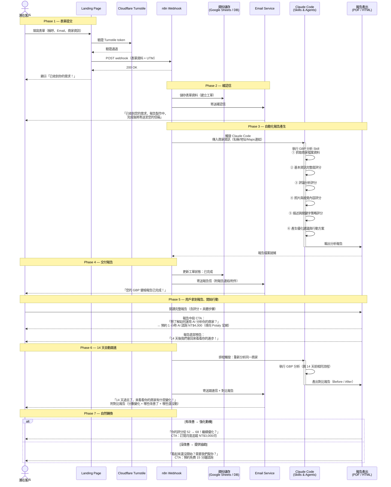

# GBP SEO 自動化流程

## Sequence Diagram

## 流程說明

### Phase 1 — 表單提交
- 用戶在 Landing Page 填寫 3 個必填欄位 + 1 個選填
- Cloudflare Turnstile 防機器人驗證
- 表單資料 POST 到 n8n webhook（含 UTM tracking）

### Phase 2 — 確認信
- n8n 收到資料後立即儲存（Google Sheets 或資料庫）
- 同步寄出確認信，讓用戶知道報告正在製作中

### Phase 3 — 自動化報告產生
- n8n 觸發 Claude Code，傳入商家資訊
- Claude Code 使用專用 Skill & Agent 執行四大面向分析：
  1. **基本資訊完整度** — 電話、地址、營業時間、類別等
  2. **評論分析** — 評論數量、平均評分、回覆率
  3. **照片與視覺內容** — 照片數量、品質、更新頻率
  4. **描述與關鍵字策略** — 商家描述、關鍵字覆蓋率
- 每個面向產生量化評分 + 具體優化建議
- 輸出最終報告（PDF / HTML）

### Phase 4 — 交付報告
- n8n 更新工單狀態
- 寄送報告完成通知信（附報告連結或附件）

### Phase 5 — 用戶執行優化
- 免費報告是**完整的**，不留白、不閹割，真心幫用戶提升曝光度
- 報告包含：四大面向評分 + 逐項問題 + 具體可執行步驟
- 報告中段嵌入 CTA：
  - **「想了解如何運用 AI 分析你的商家？」**
  - → 預約 1 小時 AI 諮詢 NT$4,000（連結導向 Potaly 官網）
  - 放在報告中段（用戶剛看完分析、正好奇「這是怎麼做到的」時），轉換時機最佳
- 報告底部預告：「14 天後我們會回來看看你的進步！」
- 這個預告做兩件事：
  1. 給用戶一個行動的時間壓力（deadline effect）
  2. 讓用戶期待被關心，而不是被推銷

### Phase 6 — 14 天自動跟進
- n8n 排程在 14 天後，自動重新觸發 Claude Code 分析同一商家
- 產出 **Before / After 對比報告**：
  - 14 天前的分數 vs. 現在的分數
  - 哪些項目改善了（綠色標記）
  - 哪些項目還沒動（紅色標記）
- 寄送跟進信：語氣是關心，不是推銷
  - 「14 天過去了，來看看你的商家有什麼變化！」

### Phase 7 — 自然轉換（依用戶狀態分流）

**情境 A：用戶有改善** → 強化動機
- 「你的評分從 52 → 68！繼續保持，想要每月追蹤進度嗎？」
- CTA：訂閱月度追蹤 NT$3,000/月（含趨勢圖 + 每月任務建議）

**情境 B：用戶沒改善** → 伸出援手
- 「看起來還沒開始動手？沒關係，很多商家都有一樣的困難。」
- CTA：預約免費 15 分鐘諮詢（真人協助，釐清阻礙）
- 諮詢後才自然導向付費服務（代操 / 陪跑）

## 待開發項目

| 項目 | 狀態 | 說明 |
|------|------|------|
| Landing Page 表單 | 已完成 | 3+1 精簡表單 |
| n8n Webhook 接收 | 待設定 | `N8N_WEBHOOK_URL` 尚未配置 |
| 確認信模板 | 待製作 | — |
| Claude Code GBP 分析 Skill | 待製作 | 四大面向分析邏輯 |
| Claude Code GBP 分析 Agent | 待製作 | 串接 Skill 的自動化 Agent |
| 報告模板（PDF/HTML） | 待製作 | 完整報告，底部預告 14 天跟進 |
| 報告完成通知信模板 | 待製作 | — |
| 14 天跟進排程（n8n） | 待製作 | 自動重新分析 + 產出 Before/After 對比 |
| Before/After 對比報告模板 | 待製作 | 分數變化 + 改善/未改善標記 |
| 跟進信模板 | 待製作 | 依改善狀態分流（有改善 / 沒改善） |
| 諮詢預約頁面 | 待製作 | 免費 15 分鐘線上諮詢 |
| AI 諮詢方案（Potaly） | 待串接 | 1hr NT$4,000，報告中段 CTA 導流 |
